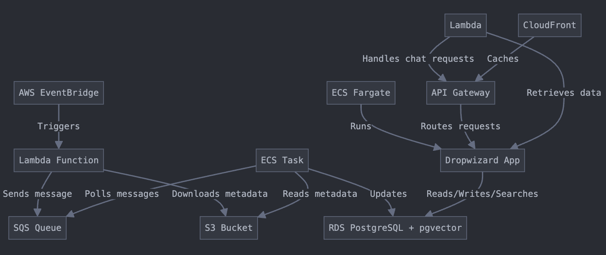

# Under Construction!

# Medical Chat
THIS IS NOT MEDICAL ADVICE. IT SIMPLY ALLOWS YOU TO CHAT WITH RESEARCH PAPERS. 
Many of these papers have not been peer reviewed.

# Getting Started

## Pull down papers

```bash
# I have just been letting intelliJ handle this, so adjust params/flags as needed.
java -cp target/MedicalChat-1.0-SNAPSHOT.jar org.doug.cli.FetchPapersCLI
```

## Start the DB

```bash
docker build -t pgvector . -f pgvector.Dockerfile
docker run -d --name pgvector -p 5432:5432 -v pgvector_data:/var/lib/postgresql/data pgvector
```

## Description

A comprehensive tool suite to pull down current medical research papers, store them in a database, and search over them.

Then we'll use LLMs to chat with that searchable index.

An architecture diagram of the desired deployed arch will look like the below:


This also is an excuse to re-learn or learn for the first time the following:

- [X] Dropwizard
- [X] Java
- [X] Maven
- [X] Pgvector
- [X] Postgres
- [ ] Loaded data into db
- [ ] Searching over data given query
- [ ] Chatting with data

## Current Status

- [x] Pull down papers


How to start the true application
---

1. Run `mvn clean install` to build your application
1. Start application with `java -jar target/MedicalChat-1.0-SNAPSHOT.jar server config.yml`
1. To check that your application is running enter url `http://localhost:8080`

Health Check
---

To see your applications health enter url `http://localhost:8081/healthcheck`
